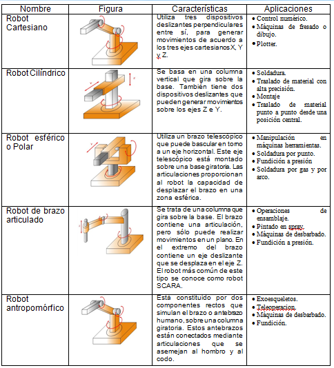

# BrazoRobotico
A medida que se ha ido mejorando la tecnología, se han desarrollado máquinas especializadas para tareas como poner tapones a las botellas o verter caucho líquido en moldes para neumáticos. Sin embargo, ninguna de estas máquinas tenía la versatilidad del brazo humano, y no podían alcanzar objetos alejados y colocarlos en la posición deseada. La mayoría de los robots existentes en nuestros días son aquellos que son utilizados en la industria, llamados robots industriales, los cuales están construidos por uno o dos brazos. En éste capítulo hablaremos de los brazos robóticos, ya que en nuestro proyecto se controló uno de éstos.
La palabra robot se define como una máquina controlada por un ordenador y programada para moverse, manipular objetos y realizar trabajos a la vez que interacciona con su entorno. Los robots son capaces de realizar tareas repetitivas de forma más rápida, barata y precisa que los seres humanos. El término procede de la palabra checa robota, que significa 'trabajo obligatorio'. Desde entonces se ha empleado la palabra robot para referirse a una máquina que realiza trabajos para ayudar a las personas para efectuar tareas difíciles o de riesgo para los humanos. Mientras tanto la robótica se define como la rama  de la inteligencia artificial que estudia los sistemas automáticos capaces de establecer una interacción directa con el mundo físico.
Los brazos robóticos han tratado de asemejar el movimiento del brazo humano, por lo que se han construido en base a las articulaciones de éstos. Las articulaciones de un brazo robótico suelen moverse mediante motores eléctricos, o dispositivos neumáticos. En la mayoría de los robots, la pinza se mueve de una posición a otra cambiando su orientación. Una computadora calcula los ángulos de las articulaciones necesarios para llevar la pinza a la posición deseada, este es un proceso conocido como cinemática inversa.
 
BRAZO ROBÓTICO DE 4 EJES
Objetivo.
El propósito de esta práctica es desarrollar paso a paso un proyecto para controlar y programar un Brazo Robot, simulando las funciones básicas de un robot industrial.
El robot debe tener dos funciones básicas:
•	Programar: Registrar las posiciones de los brazos en tres dimensiones (cada registro es un "paso", un programa consiste en una serie de pasos).
•	Ejecutar: Realice en secuencia las posiciones registradas en el "Programa". El robot ejecutará el programa hasta que se use el comando "ABORTAR". 

Características principales:
1.	El proyecto se usa para controlar robots con 4 DOF ("Grados de libertad").

2.	El robot se debe controlar en modo "REMOTO" (a través de un programa en java por medio del puerto serial).

3.	La información para el usuario se podrá proporcionar a través de LEDS de colores, una pantalla LCD de 2 líneas y/ó sonido (un zumbador).

4.	Los brazos robóticos se pueden clasificar de acuerdo con el número de "articulaciones" o "Grados de libertad" (DOF) que tienen.

5.	-La "Base", o "Cintura", por lo general puede girar el brazo 180o o 360o, dependiendo del tipo de Servo utilizado (aquí en este proyecto, se debe utilizar un motor a pasos para girar 360o) 

6.	El "Hombro" es el responsable de "levantar o bajar" el brazo verticalmente

7.	-El "codo" hará que el brazo "avance o retroceda".

8.	-La "Garra" o "Pinza" funciona abriendo o cerrándose para "agarrar cosas".

9.	Resultado. Brazo robótico 4 DOF.

